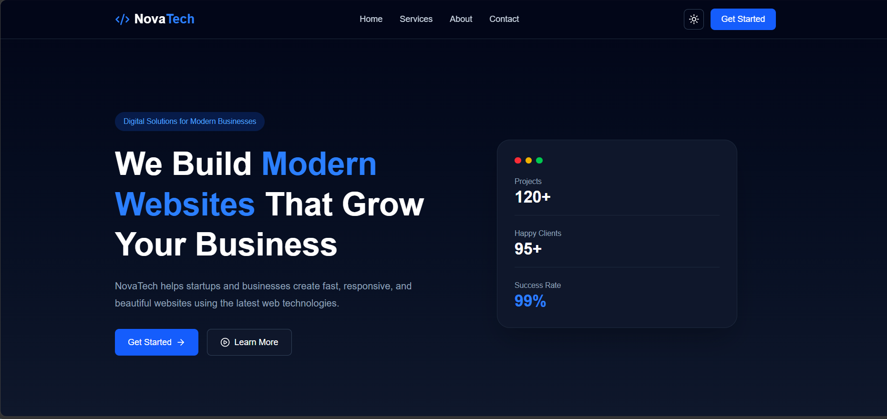
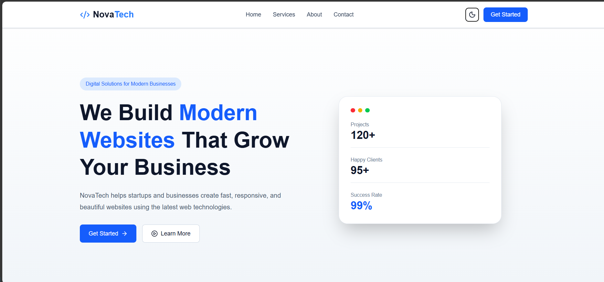

# React Theme Context

A modern and responsive landing page built with React that demonstrates theme management using the Context API. Users can switch between Light and Dark mode, and their preference is saved using localStorage.

## Preview

### Dark Theme



### Light Theme



---

## Features

- Modern responsive landing page
- Light and Dark theme toggle
- Theme persistence using localStorage
- Context API for global theme management
- Custom `useTheme` hook
- Smooth animations with Framer Motion
- Built with reusable React components
- Responsive design using Tailwind CSS

---

## Technologies Used

- React
- Vite
- Tailwind CSS
- Context API
- Framer Motion
- Lucide React
- React Icons

---

## Folder Structure

```
react-theme-context
│── public/
│── src/
│   ├── components/
│   │   ├── Navbar.jsx
│   │   ├── Hero.jsx
│   │   ├── Features.jsx
│   │   ├── About.jsx
│   │   ├── CTA.jsx
│   │   └── Footer.jsx
│   │
│   ├── context/
│   │   └── ThemeContext.jsx
│   │
│   ├── App.jsx
│   ├── main.jsx
│   └── index.css
│
├── screenshot1.png
├── screenshot2.png
├── package.json
└── README.md
```

---

## Getting Started

### Clone the repository

```bash
git clone https://github.com/Areej39/react-theme-context.git
```

### Navigate to the project

```bash
cd react-theme-context
```

### Install dependencies

```bash
npm install
```

### Start the development server

```bash
npm run dev
```

---

## Learning Outcomes

This project helped me practice:

- React component-based architecture
- Managing global state using Context API
- Creating a custom React Hook
- Working with Tailwind CSS
- Implementing Light and Dark mode
- Persisting user preferences using localStorage
- Adding animations with Framer Motion
- Building responsive layouts

---

## Future Improvements

- Mobile navigation menu
- Smooth scrolling navigation
- Active navigation links
- Contact form

---

## Author

**Areej Fatima**

GitHub: https://github.com/Areej39

---
**Live Demo**

https://react-theme-context-areej39.netlify.app/

